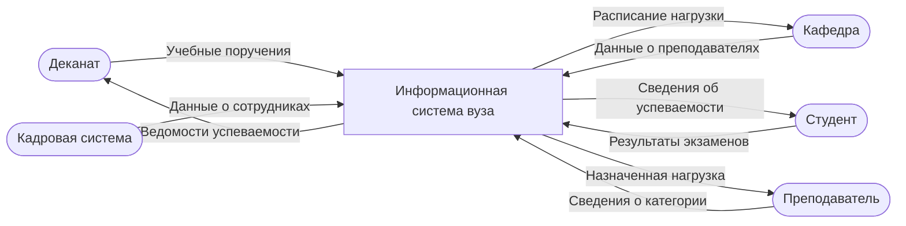

# Контекстная схема ИС вуза (DFD уровня 0)

```mermaid
flowchart LR
    Dekanat([Деканат])
    Kafedra([Кафедра])
    Student([Студент])
    Prepodavatel([Преподаватель])
    HR([Кадровая система])

    IS[Информационная система вуза]

    Dekanat -->|Учебные поручения| IS
    IS -->|Ведомости успеваемости| Dekanat

    Kafedra -->|Данные о преподавателях| IS
    IS -->|Расписание нагрузки| Kafedra

    Student -->|Результаты экзаменов| IS
    IS -->|Сведения об успеваемости| Student

    Prepodavatel -->|Сведения о категории| IS
    IS -->|Назначенная нагрузка| Prepodavatel

    HR -->|Данные о сотрудниках| IS
```