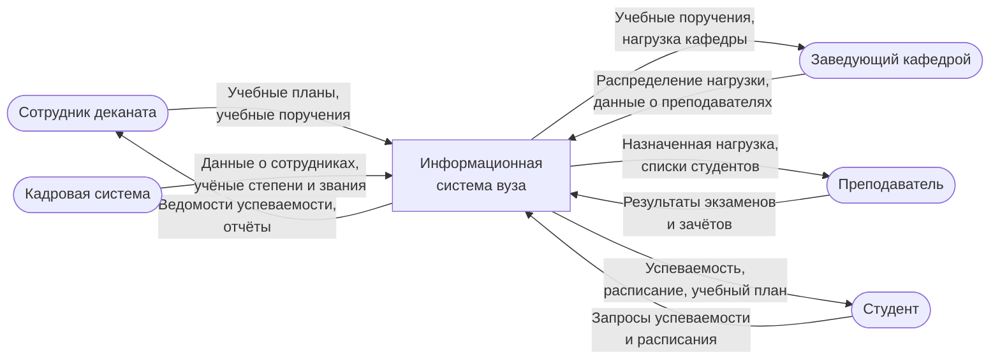
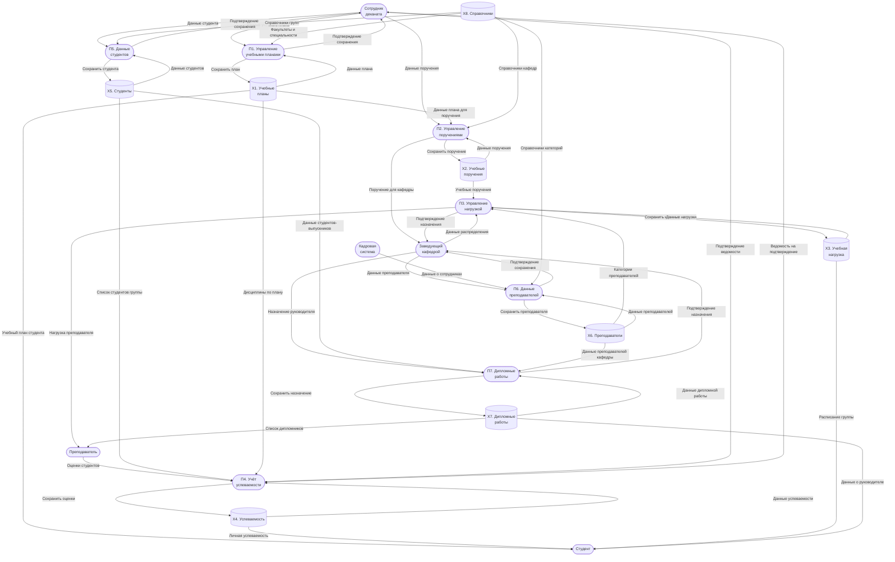

# Диаграммы потоков данных ИС вуза

## Контекстная схема (DFD уровня 0)

```mermaid
flowchart LR
    Dekanat([Сотрудник деканата])
    ZavKaf([Заведующий кафедрой])
    Teacher([Преподаватель])
    Student([Студент])
    HR([Кадровая система])

    IS[Информационная\nсистема вуза]

    Dekanat -->|Учебные планы,\nучебные поручения| IS
    IS -->|Ведомости успеваемости,\nотчёты| Dekanat

    ZavKaf -->|Распределение нагрузки,\nданные о преподавателях| IS
    IS -->|Учебные поручения,\nнагрузка кафедры| ZavKaf

    Teacher -->|Результаты экзаменов\nи зачётов| IS
    IS -->|Назначенная нагрузка,\nсписки студентов| Teacher

    Student -->|Запросы успеваемости\nи расписания| IS
    IS -->|Успеваемость,\nрасписание, учебный план| Student

    HR -->|Данные о сотрудниках,\nучёные степени и звания| IS
```

---

## DFD уровня 1

```mermaid
flowchart TB

    %% Внешние сущности
    Dekanat([Сотрудник\nдеканата])
    ZavKaf([Заведующий\nкафедрой])
    Teacher([Преподаватель])
    Student([Студент])
    HR([Кадровая\nсистема])

    %% Процессы
    P1([П1. Управление\nучебными планами])
    P2([П2. Управление\nпоручениями])
    P3([П3. Управление\nнагрузкой])
    P4([П4. Учёт\nуспеваемости])
    P5([П5. Данные\nстудентов])
    P6([П6. Данные\nпреподавателей])
    P7([П7. Дипломные\nработы])

    %% Хранилища данных
    X1[(Х1. Учебные\nпланы)]
    X2[(Х2. Учебные\nпоручения)]
    X3[(Х3. Учебная\nнагрузка)]
    X4[(Х4. Успеваемость)]
    X5[(Х5. Студенты)]
    X6[(Х6. Преподаватели)]
    X7[(Х7. Дипломные\nработы)]
    X8[(Х8. Справочники)]

    %% П1 - Управление учебными планами
    Dekanat -->|Данные учебного плана| P1
    P1 -->|Сохранить план| X1
    X1 -->|Данные плана| P1
    P1 -->|Подтверждение сохранения| Dekanat
    X1 -->|Учебный план студента| Student
    X8 -->|Факультеты и специальности| P1

    %% П2 - Управление учебными поручениями
    Dekanat -->|Данные поручения| P2
    X1 -->|Данные плана для поручения| P2
    P2 -->|Сохранить поручение| X2
    X2 -->|Данные поручения| P2
    P2 -->|Поручение для кафедры| ZavKaf
    X8 -->|Справочники кафедр| P2

    %% П3 - Управление учебной нагрузкой
    ZavKaf -->|Данные распределения| P3
    X2 -->|Учебные поручения| P3
    X6 -->|Категории преподавателей| P3
    P3 -->|Сохранить нагрузку| X3
    X3 -->|Данные нагрузки| P3
    P3 -->|Нагрузка преподавателя| Teacher
    P3 -->|Подтверждение назначения| ZavKaf

    %% П4 - Учёт успеваемости
    Teacher -->|Оценки студентов| P4
    X5 -->|Список студентов группы| P4
    X1 -->|Дисциплины по плану| P4
    P4 -->|Сохранить оценки| X4
    X4 -->|Данные успеваемости| P4
    P4 -->|Ведомость на подтверждение| Dekanat
    Dekanat -->|Подтверждение ведомости| P4
    X4 -->|Личная успеваемость| Student

    %% П5 - Управление данными студентов
    Dekanat -->|Данные студента| P5
    P5 -->|Сохранить студента| X5
    X5 -->|Данные студентов| P5
    P5 -->|Подтверждение сохранения| Dekanat
    X3 -->|Расписание группы| Student
    X8 -->|Справочники групп| P5

    %% П6 - Управление данными преподавателей
    ZavKaf -->|Данные преподавателя| P6
    HR -->|Данные о сотрудниках| P6
    P6 -->|Сохранить преподавателя| X6
    X6 -->|Данные преподавателей| P6
    P6 -->|Подтверждение сохранения| ZavKaf
    X8 -->|Справочники категорий| P6

    %% П7 - Управление дипломными работами
    ZavKaf -->|Назначение руководителя| P7
    X5 -->|Данные студентов-выпускников| P7
    X6 -->|Данные преподавателей кафедры| P7
    P7 -->|Сохранить назначение| X7
    X7 -->|Данные дипломной работы| P7
    P7 -->|Подтверждение назначения| ZavKaf
    X7 -->|Данные о руководителе| Student
    X7 -->|Список дипломников| Teacher
```