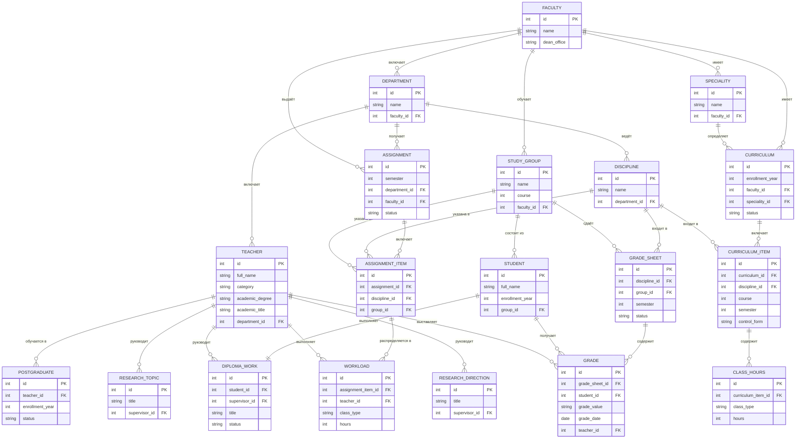

# ER-диаграмма ИС вуза

```mermaid
erDiagram

    FACULTY {
        int id PK
        string name
        string dean_office
    }

    DEPARTMENT {
        int id PK
        string name
        int faculty_id FK
    }

    SPECIALITY {
        int id PK
        string name
        int faculty_id FK
    }

    STUDY_GROUP {
        int id PK
        string name
        int course
        int faculty_id FK
    }

    STUDENT {
        int id PK
        string full_name
        int enrollment_year
        int group_id FK
    }

    TEACHER {
        int id PK
        string full_name
        string category
        string academic_degree
        string academic_title
        int department_id FK
    }

    DISCIPLINE {
        int id PK
        string name
        int department_id FK
    }

    CURRICULUM {
        int id PK
        int enrollment_year
        int faculty_id FK
        int speciality_id FK
        string status
    }

    CURRICULUM_ITEM {
        int id PK
        int curriculum_id FK
        int discipline_id FK
        int course
        int semester
        string control_form
    }

    CLASS_HOURS {
        int id PK
        int curriculum_item_id FK
        string class_type
        int hours
    }

    ASSIGNMENT {
        int id PK
        int semester
        int department_id FK
        int faculty_id FK
        string status
    }

    ASSIGNMENT_ITEM {
        int id PK
        int assignment_id FK
        int discipline_id FK
        int group_id FK
    }

    WORKLOAD {
        int id PK
        int assignment_item_id FK
        int teacher_id FK
        string class_type
        int hours
    }

    GRADE_SHEET {
        int id PK
        int discipline_id FK
        int group_id FK
        int semester
        string status
    }

    GRADE {
        int id PK
        int grade_sheet_id FK
        int student_id FK
        string grade_value
        date grade_date
        int teacher_id FK
    }

    DIPLOMA_WORK {
        int id PK
        int student_id FK
        int supervisor_id FK
        string title
        string status
    }

    POSTGRADUATE {
        int id PK
        int teacher_id FK
        int enrollment_year
        string status
    }

    RESEARCH_TOPIC {
        int id PK
        string title
        int supervisor_id FK
    }

    RESEARCH_DIRECTION {
        int id PK
        string title
        int supervisor_id FK
    }

    %% Связи факультет - кафедра - специальность
    FACULTY ||--o{ DEPARTMENT : "включает"
    FACULTY ||--o{ SPECIALITY : "имеет"
    FACULTY ||--o{ STUDY_GROUP : "обучает"

    %% Связи кафедра - преподаватель - дисциплина
    DEPARTMENT ||--o{ TEACHER : "включает"
    DEPARTMENT ||--o{ DISCIPLINE : "ведёт"

    %% Связи студент - группа
    STUDY_GROUP ||--o{ STUDENT : "состоит из"

    %% Связи учебный план
    FACULTY ||--o{ CURRICULUM : "имеет"
    SPECIALITY ||--o{ CURRICULUM : "определяет"
    CURRICULUM ||--o{ CURRICULUM_ITEM : "включает"
    DISCIPLINE ||--o{ CURRICULUM_ITEM : "входит в"
    CURRICULUM_ITEM ||--o{ CLASS_HOURS : "содержит"

    %% Связи учебные поручения
    DEPARTMENT ||--o{ ASSIGNMENT : "получает"
    FACULTY ||--o{ ASSIGNMENT : "выдаёт"
    ASSIGNMENT ||--o{ ASSIGNMENT_ITEM : "включает"
    DISCIPLINE ||--o{ ASSIGNMENT_ITEM : "указана в"
    STUDY_GROUP ||--o{ ASSIGNMENT_ITEM : "указана в"

    %% Связи нагрузка
    ASSIGNMENT_ITEM ||--o{ WORKLOAD : "распределяется в"
    TEACHER ||--o{ WORKLOAD : "выполняет"

    %% Связи успеваемость
    DISCIPLINE ||--o{ GRADE_SHEET : "входит в"
    STUDY_GROUP ||--o{ GRADE_SHEET : "сдаёт"
    GRADE_SHEET ||--o{ GRADE : "содержит"
    STUDENT ||--o{ GRADE : "получает"
    TEACHER ||--o{ GRADE : "выставляет"

    %% Связи дипломные работы
    STUDENT ||--|| DIPLOMA_WORK : "выполняет"
    TEACHER ||--o{ DIPLOMA_WORK : "руководит"

    %% Связи аспирантура и наука
    TEACHER ||--o{ POSTGRADUATE : "обучается в"
    TEACHER ||--o{ RESEARCH_TOPIC : "руководит"
    TEACHER ||--o{ RESEARCH_DIRECTION : "руководит"
```